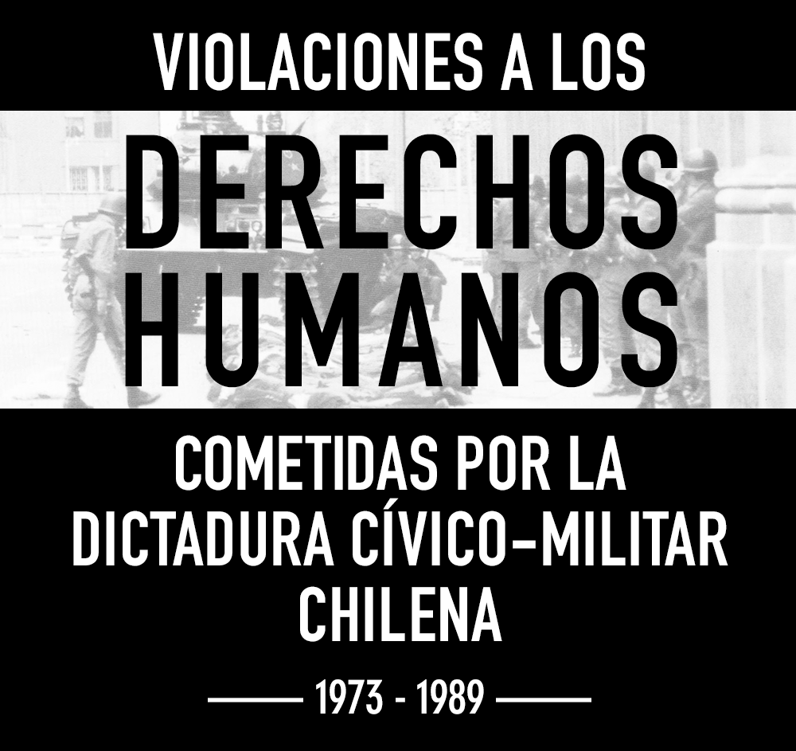

# Infografía: Violaciones a los Derechos Humanos cometidas por la dictadura cívico-militar chilena

Infografía que recopila visualizaciones de datos acerca de los crímenes de lesa humanidad cometidos por el régimen dictatorial en Chile, entre entre 1973 y 1989.

[Ver infografía](https://bastianolea.github.io/violaciones_ddhh_chile/)

